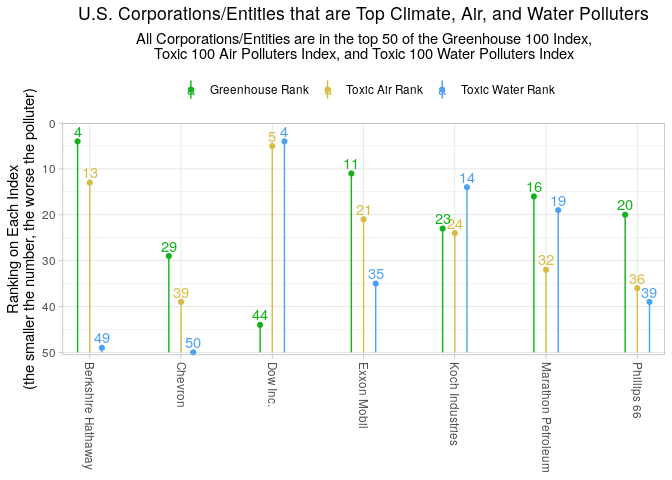

<!-- README.md is generated from README.Rmd. Please edit that file -->

<!-- You'll still need to render `README.Rmd` regularly, to keep `README.md` up-to-date. `devtools::build_readme()` is handy for this.  -->

# Top Climate, Air, and Water Polluters (data from 2018)

<!-- badges: start -->

<!-- badges: end -->

Researchers at the Political Economy Research Institute (PERI) at the
University of Massachusetts Amherst created this all encompassing
dataset on the top 100 parent entities or corporations that contributed
to greenhouse gas pollution, air pollution, and water pollution.

## Installation

The development version of XXX is available from
[GitHub](https://github.com/) with:

``` r
install.packages("devtools")
#> Installing package into '/tmp/RtmpNRmzp3/temp_libpath32b72a6a0e00'
#> (as 'lib' is unspecified)
install.packages("topPolluters")
#> Installing package into '/tmp/RtmpNRmzp3/temp_libpath32b72a6a0e00'
#> (as 'lib' is unspecified)
#> Warning: package 'topPolluters' is not available for this version of R
#> 
#> A version of this package for your version of R might be available elsewhere,
#> see the ideas at
#> https://cran.r-project.org/doc/manuals/r-patched/R-admin.html#Installing-packages
library(topPolluters)
#> Loading required package: dplyr
#> 
#> Attaching package: 'dplyr'
#> The following objects are masked from 'package:stats':
#> 
#>     filter, lag
#> The following objects are masked from 'package:base':
#> 
#>     intersect, setdiff, setequal, union
library(tidyr)
library(ggplot2)
library(viridis)
#> Loading required package: viridisLite
library(forcats)
### Sample of the data.
head(topPolluters)
#>         polluter toxic.air.rank greenhouse.rank toxic.air.poor
#> 1 LyondellBasell              1              91           0.17
#> 2         Boeing              2              NA           0.15
#> 3       Huntsman              3              NA           0.15
#> 4           BASF              4             147           0.20
#> 5       Dow Inc.              5              44           0.20
#> 6       Celanese              6              NA           0.15
#>   toxic.air.minority greenhouse.poor greenhouse.minority toxic.water.rank
#> 1               0.68            0.19                0.78                3
#> 2               0.35              NA                  NA               77
#> 3               0.47              NA                  NA              135
#> 4               0.35            0.15                0.48                2
#> 5               0.42            0.18                0.50                4
#> 6               0.59              NA                  NA                5
```

## Example 1 - Are there any corporations/entities that rank highly (as top polluters) in all three indexes?

``` r
filter(topPolluters, toxic.air.rank <= 50, greenhouse.rank <= 50, toxic.water.rank <= 50) %>%
  pivot_longer(
    cols = c(toxic.air.rank, greenhouse.rank, toxic.water.rank),
    names_to = "rank.type",
    values_to = "ranking") %>%
  ggplot(aes(x = polluter, y = ranking, label = ranking, colour = rank.type)) +
  geom_linerange(aes(x = polluter, ymin = 50, ymax = ranking, colour = rank.type), 
                   position = position_dodge(width = .4))+
  geom_point(aes(x = polluter, y = ranking, colour = rank.type),
               position = position_dodge(width = .4))+
  scale_x_discrete(expand = expansion(add = c(.3, .3))) +
  scale_y_continuous(trans = "reverse",
                     expand = expansion(add = c(.6, 4))) +
  scale_color_manual(
    labels = c("Greenhouse Rank", "Toxic Air Rank", "Toxic Water Rank"),
    values = c("#11B31A", "#D8BC42", "#4DA2F0")) +
  geom_text(aes(label = round(ranking, .4)), 
            position = position_dodge(0.4), vjust = -.4)+
  labs( 
    title = "U.S. Corporations/Entities that are Top Climate, Air, and Water Polluters",
    subtitle = "All Corporations/Entities are in the top 50 of the Greenhouse 100 Index,\nToxic 100 Air Polluters Index, and Toxic 100 Water Polluters Index",
    y = "Ranking on Each Index\n(the smaller the number, the worse the polluter)"
  ) +
  theme_light()+
  theme(legend.position = "top",
        plot.title = element_text(hjust = 0.5),
        plot.subtitle = element_text(hjust = 0.5),
        axis.title.x = element_blank(),
        legend.title = element_blank(),
        axis.text.x = element_text(angle = -90, hjust = 0)) 
```


## Example 2 - Do top toxic air polluters negatively impact marginalized communities at a disproportional rate?

``` r
topPolluters %>%
  filter(toxic.air.rank <= 30) %>%
  select(polluter, toxic.air.rank, toxic.air.poor, toxic.air.minority) %>%
  pivot_longer(
    cols = c(toxic.air.minority, toxic.air.poor),
    names_to = "metric",
    values_to = "percentage"
  ) %>%
  mutate(percentage = percentage * 100) %>%
  ggplot(aes(x = polluter, y = percentage, fill = metric)) +
  geom_bar(width = 0.7, position = "dodge", stat = "identity") +
  theme_bw() +
  aes(x = fct_reorder(polluter, toxic.air.rank, .desc = TRUE)) +
  scale_y_continuous(
    breaks = c(0, 20, 40, 60, 80, 100),
    labels = c("0%", "20%", "40%", "60%", "80%", "100%"),
    expand = expansion(add = c(0, 2))
  ) +
  labs(
    title = "The Top 30 U.S. Industrial Pollutors of Air Toxics of 2018 and the\nResulting Exposure to Low-Income People and\nRacial/Ethnic Minorities",
    caption = "The ranking of the top air pollutors is based on total potential chronic human health risk from their facilities.\nThe percentages are in regards to the makeup of the at-risk populations (which are typically those nearest to\nthe toxic facilities), but spefically how much of the at risk population is below the poverty line or is a racial/ethnic minority.",
    x = "Top Pollutors of Air Toxics\n(in Descending Order of Rank)",
    y = "Percent Group Makes Up of Total At-Risk Population"
  ) +
  theme(
    legend.title = element_blank(),
    plot.title = element_text(hjust = 0),
    plot.caption = element_text(hjust = 0, size = 8),
    legend.position = "top"
  ) +
  scale_fill_manual(
    values = c("#E69F00", "#56B4E9"),
    breaks = c("toxic.air.poor", "toxic.air.minority"),
    labels = c("People below the poverty line", "Racial/ethnic minorities")
  ) +
  coord_flip()
```


